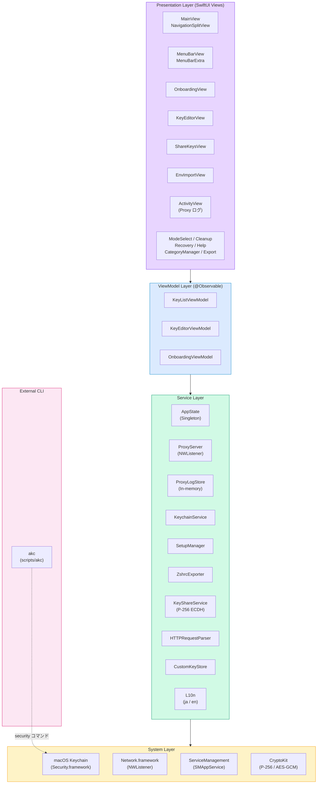
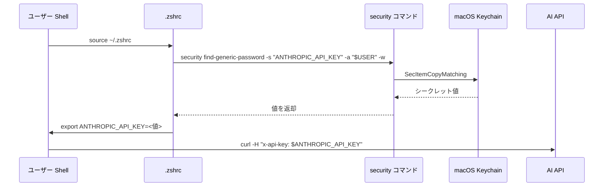
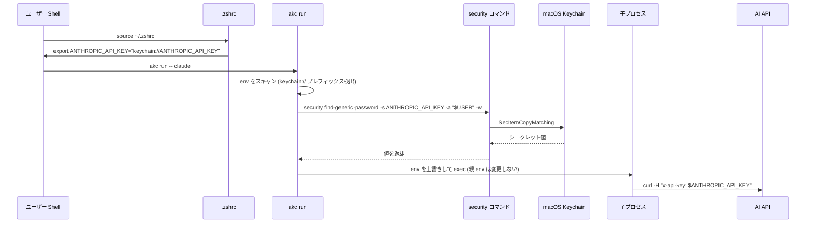
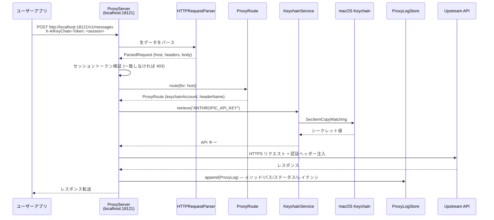
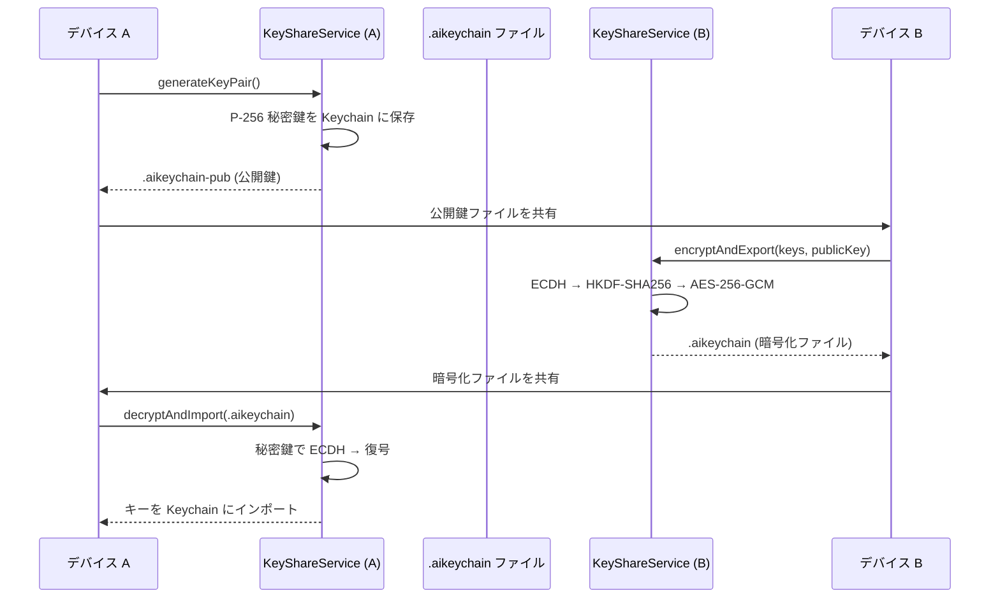

# アーキテクチャ設計

## レイヤー構成



### レイヤー責務

| レイヤー | 責務 | 主要コンポーネント |
|---------|------|------------------|
| **Presentation** | UI 表示・ユーザー操作受付 | MainView, MenuBarView, OnboardingView, KeyEditorView, ActivityView 他 |
| **ViewModel** | 画面状態管理・ビジネスロジック | KeyListViewModel, KeyEditorViewModel, OnboardingViewModel |
| **Service** | アプリ固有の処理・外部連携 | AppState, ProxyServer, ProxyLogStore, KeychainService, SetupManager, KeyShareService, L10n |
| **System** | OS フレームワーク | Security.framework, Network.framework, CryptoKit, ServiceManagement |
| **External CLI** | Secret Reference 解決 | `akc` (Bash スクリプト) |

## データフロー

### Standard モード



### Secret Reference モード



### Proxy モード



::: tip セッショントークン
プロキシ起動ごとに UUID を生成し、`~/.aikeychain_proxy` に `AIKEYCHAIN_SESSION_TOKEN` として書き出す。
クライアントは `X-AIKeyChain-Token` ヘッダで提示し、不一致は 403 で拒否される。
これにより同じ localhost に同居する他プロセスからの不正利用を防止する。
:::

### デバイス間キー転送



## ファイル構成

```
AIkeychain/
├── AIkeychainApp.swift              # エントリポイント (Window + MenuBarExtra)
│
├── Resources/
│   └── AIkeychain.entitlements      # Keychain アクセスグループ + ネットワーク
│
├── Models/
│   ├── APIKey.swift                 # キー情報 (プリセット + カスタム)
│   ├── ServiceType.swift            # 17 サービス定義 (6 カテゴリ)
│   ├── KeyCategory.swift            # 6 カテゴリ定義
│   ├── OnboardingStep.swift         # 6 ステップ定義 (language を含む)
│   ├── CustomKeyStore.swift         # カスタムキー・カテゴリ永続化
│   ├── ProxyRoute.swift             # プロキシルーティング定義
│   ├── ProxyLog.swift               # プロキシ通過ログ + ProxyLogStore
│   └── AppLanguage.swift            # アプリ表示言語 (ja / en)
│
├── Services/
│   ├── AppState.swift               # グローバル状態 (シングルトン, 3 モード)
│   ├── ProxyServer.swift            # NWListener HTTP プロキシ + セッショントークン
│   ├── KeychainService.swift        # Keychain CRUD (Protocol ベース)
│   ├── SetupManager.swift           # .zshrc / プロキシ設定ファイル ライフサイクル
│   ├── KeyShareService.swift        # P-256 ECDH + AES-256-GCM キー転送
│   ├── HTTPRequestParser.swift      # HTTP/1.1 リクエストパーサー
│   ├── ZshrcExporter.swift          # .zshrc / Secret Reference / .env エクスポート
│   └── L10n.swift                   # 多言語化テーブル (ja / en)
│
├── ViewModels/
│   ├── KeyListViewModel.swift       # キー一覧管理・フィルタリング
│   ├── KeyEditorViewModel.swift     # キー追加・編集バリデーション
│   └── OnboardingViewModel.swift    # オンボーディングフロー制御
│
├── Views/
│   ├── Main/
│   │   ├── MainView.swift           # ルート (NavigationSplitView)
│   │   ├── SidebarView.swift        # カテゴリ + Activity ナビゲーション
│   │   ├── KeyListView.swift        # キーグリッド + 検索
│   │   └── KeyRowView.swift         # キーセル
│   ├── Editor/
│   │   └── KeyEditorView.swift      # 追加・編集フォーム
│   ├── Onboarding/
│   │   └── OnboardingView.swift     # 6 ステップウィザードコンテナ
│   ├── Export/
│   │   └── ExportView.swift         # .zshrc / Secret Reference / .env エクスポート
│   ├── ActivityView.swift           # プロキシリクエストログ表示
│   ├── MenuBarView.swift            # メニューバーポップオーバー
│   ├── ModeSelectView.swift         # Standard / Secret Reference / Proxy 選択
│   ├── ShareKeysView.swift          # 暗号化キー転送 (P-256)
│   ├── EnvImportView.swift          # 4 ステップ env インポート
│   ├── CategoryManagerView.swift    # カスタムカテゴリ管理
│   ├── CleanupView.swift            # .zshrc クリーンアップ
│   ├── RecoveryView.swift           # プロキシ復旧ガイド
│   └── HelpView.swift               # ユーザーマニュアル
│
├── Components/
│   ├── CategoryIcon.swift           # カテゴリアイコン
│   ├── ServiceIcon.swift            # サービスアイコン
│   └── StatusBadge.swift            # 設定済み/未設定バッジ
│
└── Theme/
    ├── AppColors.swift              # カラーパレット
    ├── AppFonts.swift               # タイポグラフィ
    └── AppAnimations.swift          # トランジションアニメーション

scripts/
└── akc                              # Secret Reference 解決 CLI (Bash)
```

## 状態管理方針

macOS 14+ の **Observation framework** (`@Observable`) を採用。

### AppState — グローバル状態 (シングルトン)

```swift
@Observable
final class AppState {
    static let shared = AppState()
    static let defaultPort: UInt16 = 18121

    let proxyServer = ProxyServer()
    let proxyLogStore = ProxyLogStore()

    var keyManagementMode: KeyManagementMode  // .standard / .secretReference / .proxy
    var appLanguage: AppLanguage              // .ja / .en
    var hasProxyConsent: Bool
    var proxyPort: UInt16                     // デフォルト 18121
    var launchAtLogin: Bool                   // SMAppService 連携

    var isProxyMode: Bool { keyManagementMode == .proxy }
    var isSecretRefMode: Bool { keyManagementMode == .secretReference }

    func startProxyIfNeeded()                 // アプリ起動時の自動開始 (Proxy モード時のみ)
    func stopProxy()                          // プロキシ停止 + 設定ファイル削除
    func switchMode(to:)                      // モード切替 + プロキシ起動/停止
    func changePort(to:)                      // ポート変更 + 再起動
}
```

### ViewModel — 画面ごとの状態

```swift
@Observable
final class KeyListViewModel {
    var keys: [APIKey] = []
    var selectedCategory: CategorySelection?
    var searchText: String = ""
    var filteredKeys: [APIKey] { /* カテゴリ + 検索フィルタ */ }

    private let keychainService: KeychainServiceProtocol  // DI 可能
}
```

::: tip なぜ @Observable？
- `ObservableObject` + `@Published` よりパフォーマンスが良い（プロパティ単位の追跡）
- ボイラープレートが少ない
- SwiftUI との統合がよりシンプル
:::

### 永続化戦略

| データ | 保存先 | 理由 |
|--------|--------|------|
| シークレット値 | macOS Keychain | セキュリティ最優先 |
| カスタムキー・カテゴリ | UserDefaults (JSON) | 軽量な構造化データ |
| オンボーディング完了フラグ | UserDefaults | 単純なブール値 |
| モード選択・ポート番号 | UserDefaults | アプリ設定 |
| アプリ表示言語 | UserDefaults (`app_language`) | 起動時に復元 |
| プロキシ設定 (BASE_URL / Session token) | `~/.aikeychain_proxy` | シェルから参照、起動時生成・停止時削除 |
| プロキシリクエストログ | メモリのみ | セキュリティ要件 (ディスクに残さない) |

## エラーハンドリング方針

### Keychain エラー

```swift
enum KeychainError: LocalizedError {
    case duplicateItem
    case itemNotFound
    case invalidData
    case unexpectedStatus(OSStatus)

    var errorDescription: String? {
        switch self {
        case .duplicateItem: "キーは既に登録されています"
        case .itemNotFound: "キーが見つかりません"
        case .invalidData: "データ形式が不正です"
        case .unexpectedStatus(let status): "予期しないエラー: \(status)"
        }
    }
}
```

### ProxyServer エラー

| 状況 | ハンドリング |
|------|------------|
| ポート使用中 | `lastError` に記録、MenuBar に表示 |
| セッショントークン不一致 / 未提示 | HTTP 403 を返却 |
| ルート未定義 | HTTP 502 を返却 (任意のホストへの転送を防止) |
| Keychain 読取失敗 | HTTP 401 を返却 (キーなしで上流に送信しない) |
| 上流 API 接続失敗 | HTTP 502 をクライアントに返却 |
| リクエストパース失敗 | HTTP 400 を返却 |

すべてのレスポンスは `ProxyLogStore` に追記され、Activity 画面とメニューバーに反映される。

### SetupManager エラー

| 状況 | ハンドリング |
|------|------------|
| .zshrc 読取失敗 | エラーログ、UI にフォールバック表示 |
| .zshrc 書込失敗 | ユーザーに手動設定を案内 |
| security コマンド失敗 | isConfigured を false に設定 |

::: warning 設計方針
- エラーは可能な限り **ユーザーに可視化** する（MenuBar ステータス、Activity、アラート）
- プロキシのエラーは **リクエスト単位で隔離** し、サーバー全体を停止しない
- Keychain エラーは `LocalizedError` で日本語メッセージを提供
:::
