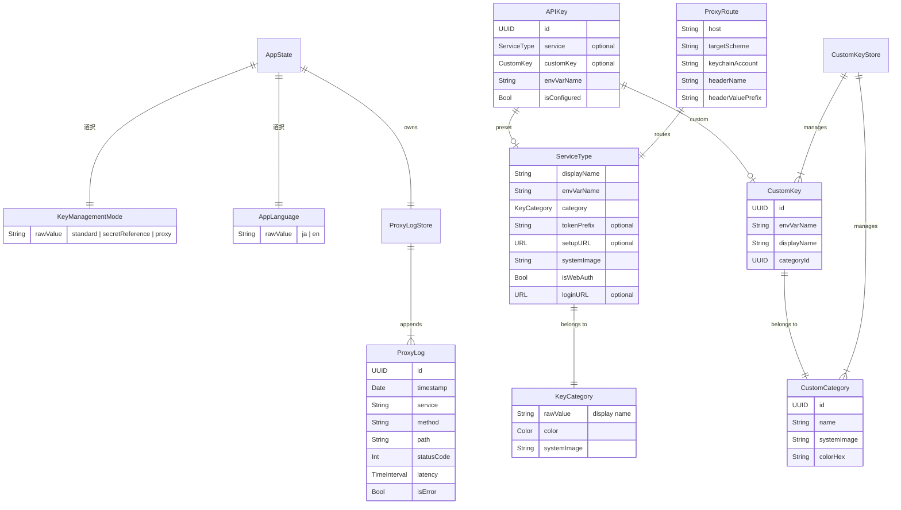

# データモデル設計

## モデル関連図



## KeyManagementMode

ユーザーが選択するキー管理モード。`UserDefaults` キー `key_management_mode` に永続化される。

```swift
enum KeyManagementMode: String {
    case standard          // .zshrc で security 直接参照
    case secretReference   // keychain:// 参照を akc run で実行時解決
    case proxy             // ローカルプロキシで認証ヘッダ注入
}
```

| Mode | displayName | アプリ常駐 | 親 env への露出 | 子 env への露出 |
|------|-------------|:----:|:----:|:----:|
| `.standard` | "Standard" | 不要 | キー値 | キー値 |
| `.secretReference` | "Secret Reference" | 不要 | 参照パス | キー値 (`akc run` 実行時のみ) |
| `.proxy` | "Proxy" | 必要 | `*_BASE_URL` のみ | なし |

## AppLanguage

```swift
enum AppLanguage: String, CaseIterable {
    case ja
    case en
}
```

`UserDefaults` キー `app_language` に永続化される。`L10n.t(_:)` 経由で UI 文言を切り替える。

## ServiceType

17 サービスを 6 カテゴリに分類。

### プロパティ

| プロパティ | 型 | 説明 |
|-----------|-----|------|
| `displayName` | String | UI 表示名 |
| `envVarName` | String | 環境変数名 |
| `category` | KeyCategory | 所属カテゴリ |
| `tokenPrefix` | String? | 期待されるトークンプレフィックス |
| `setupURL` | URL? | トークン発行ページ |
| `systemImage` | String | SF Symbols 名 |
| `isWebAuth` | Bool | Web 認証タイプかどうか |
| `loginURL` | URL? | Web ログインページ |

### サービス定義一覧

#### AI API

| Service | displayName | envVarName | tokenPrefix | category |
|---------|------------|------------|-------------|----------|
| anthropic | Anthropic (Claude) | ANTHROPIC_API_KEY | `sk-ant-` | ai |
| openAI | OpenAI | OPENAI_API_KEY | `sk-` | ai |
| xAI | xAI (Grok) | XAI_API_KEY | `xai-` | ai |
| higgsfield | Higgsfield | HIGGSFIELD_API_KEY | - | ai |

#### AI Web (Web 認証)

| Service | displayName | envVarName | loginURL |
|---------|------------|------------|----------|
| anthropicWeb | Anthropic Console | ANTHROPIC_WEB_AUTH | claude.ai |
| openAIWeb | OpenAI Platform | OPENAI_WEB_AUTH | platform.openai.com |
| googleAIStudio | Google AI Studio | GOOGLE_AI_STUDIO_AUTH | aistudio.google.com |
| huggingFace | Hugging Face | HUGGINGFACE_AUTH | huggingface.co |
| replicateWeb | Replicate | REPLICATE_AUTH | replicate.com |

#### Code & Git

| Service | displayName | envVarName | tokenPrefix |
|---------|------------|------------|-------------|
| github | GitHub | GITHUB_TOKEN | `ghp_` |
| gitlab | GitLab | GITLAB_TOKEN | `glpat-` |

#### Cloud & Infra

| Service | displayName | envVarName | tokenPrefix |
|---------|------------|------------|-------------|
| cloudflareAPI | Cloudflare API | CLOUDFLARE_API_TOKEN | - |
| cloudflareAccount | Cloudflare Account | CLOUDFLARE_ACCOUNT_ID | - |
| tailscale | Tailscale | TAILSCALE_AUTH_KEY | `tskey-` |

#### Communication

| Service | displayName | envVarName | tokenPrefix |
|---------|------------|------------|-------------|
| discord | Discord | DISCORD_TOKEN | - |
| slack | Slack | SLACK_APP_TOKEN | `xapp-` |

#### Developer Tools

| Service | displayName | envVarName | tokenPrefix |
|---------|------------|------------|-------------|
| qiita | Qiita | QIITA_TOKEN | - |

## KeyCategory

6 つのビルトインカテゴリ。

```swift
enum KeyCategory: String, CaseIterable, Identifiable {
    case ai = "AI API"
    case webAuth = "AI Web"
    case codeAndGit = "Code & Git"
    case cloud = "Cloud & Infra"
    case communication = "Communication"
    case devTools = "Developer Tools"
}
```

| Category | color | systemImage | Hex |
|----------|-------|-------------|-----|
| ai | Purple | brain.head.profile | `#7C3AED` |
| webAuth | Pink | globe | `#DB2777` |
| codeAndGit | Orange | chevron.left.forwardslash.chevron.right | `#EA580C` |
| cloud | Blue | cloud.fill | `#0284C7` |
| communication | Green | bubble.left.and.bubble.right.fill | `#059669` |
| devTools | Gray | wrench.and.screwdriver.fill | `#6B7280` |

## APIKey

プリセットサービスとカスタムキーの両方を統一的に扱うモデル。

```swift
struct APIKey: Identifiable {
    let id: UUID
    let service: ServiceType?      // プリセットの場合
    let customKey: CustomKey?       // カスタムの場合
    var envVarName: String
    var isConfigured: Bool          // Keychain に値が存在するか
}
```

### 算出プロパティ

| プロパティ | 型 | 説明 |
|-----------|-----|------|
| `displayName` | String | service?.displayName ?? customKey?.displayName |
| `systemImage` | String | サービスまたはカテゴリのアイコン |
| `categoryColor` | Color | 所属カテゴリの色 |
| `setupURL` | URL? | トークン発行ページ (プリセットのみ) |
| `tokenPrefix` | String? | プレフィックス (プリセットのみ) |
| `isCustom` | Bool | customKey != nil |

### 初期化パターン

```swift
// プリセットキー
APIKey(service: .anthropic)
// → envVarName = "ANTHROPIC_API_KEY", displayName = "Anthropic (Claude)"

// カスタムキー
APIKey(customKey: CustomKey(envVarName: "MY_KEY", displayName: "My Key", categoryId: ...))
```

::: warning 設計ポイント
- **シークレット値はモデルに持たない**: 表示時に都度 Keychain から取得
- **isConfigured は stored property**: Keychain アクセスのパフォーマンスを考慮し、`loadKeys()` 時に一括チェック
- **デュアル初期化**: service / customKey の排他的なオプショナルで柔軟性を確保
:::

## CustomKeyStore

ユーザー定義のカテゴリとキーを管理するシングルトン。

```swift
final class CustomKeyStore {
    static let shared = CustomKeyStore()

    var categories: [CustomCategory]     // ユーザー定義カテゴリ
    var keys: [CustomKey]                // ユーザー定義キー
    var categoryOverrides: [String: ...]  // プリセットキーのカテゴリ変更
}
```

| データ | 永続化 | キー |
|--------|--------|------|
| categories | UserDefaults (JSON) | `"custom_categories"` |
| keys | UserDefaults (JSON) | `"custom_keys"` |
| categoryOverrides | UserDefaults (JSON) | `"category_overrides"` |

## ProxyRoute

プロキシサーバーのルーティングテーブル。静的定義。

```swift
struct ProxyRoute {
    let host: String              // "api.anthropic.com"
    let targetScheme: String      // "https"
    let keychainAccount: String   // "ANTHROPIC_API_KEY"
    let headerName: String        // "x-api-key"
    let headerValuePrefix: String // "" or "Bearer "

    static func route(for host: String) -> ProxyRoute?
}
```

| Host | keychainAccount | headerName | headerValuePrefix |
|------|----------------|------------|-------------------|
| api.anthropic.com | ANTHROPIC_API_KEY | x-api-key | (なし) |
| api.openai.com | OPENAI_API_KEY | Authorization | Bearer |
| api.x.ai | XAI_API_KEY | Authorization | Bearer |

## ProxyLog / ProxyLogStore

プロキシを通過したリクエストの可視化用ログ。**ディスクには永続化せず、メモリ上のみで保持** する（セキュリティ要件）。

```swift
struct ProxyLog: Identifiable {
    let id: UUID
    let timestamp: Date
    let service: String       // "api.anthropic.com" など (host 値)
    let method: String        // GET / POST など
    let path: String          // /v1/messages など
    let statusCode: Int
    let latency: TimeInterval
    let isError: Bool
}

@Observable
final class ProxyLogStore {
    var logs: [ProxyLog] = []
    var todayCount: Int { ... }
    var todayErrorCount: Int { ... }
    func append(_ log: ProxyLog)
    func clear()
}
```

::: warning 設計ポイント
- **トークン値・リクエストボディは含めない**（漏洩リスク回避）
- **アプリ終了で消える**（ディスクログなし）
- Activity 画面・メニューバーから参照
:::

## OnboardingStep

6 段階のオンボーディングウィザード。

```swift
enum OnboardingStep: Int, CaseIterable {
    case language = 0     // 表示言語選択 (ja / en)
    case welcome          // ウェルカム
    case modeSelect       // Standard / Secret Reference / Proxy 選択
    case registerKeys     // キー登録案内 (スキップ可)
    case setupShell       // シェル設定 (スキップ可)
    case completion       // 完了
}
```

| Step | systemImage | canSkip |
|------|-------------|---------|
| language | globe | false |
| welcome | key.fill | false |
| modeSelect | switch.2 | false |
| registerKeys | plus.circle | true |
| setupShell | terminal | true |
| completion | checkmark.seal.fill | false |
