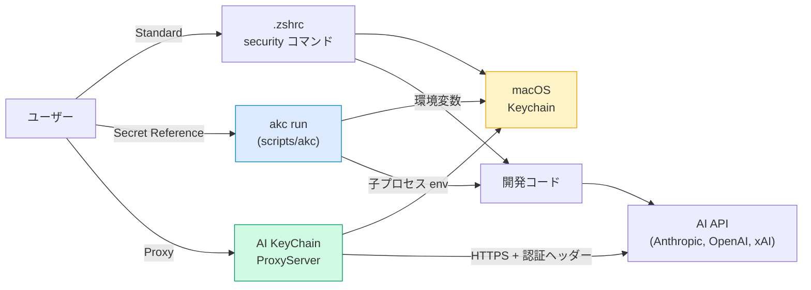

# 設計書 概要

AI KeyChain の設計ドキュメント一覧です。本ドキュメントは v1.6.0 時点の実装に対応しています。

## ドキュメント構成

| ドキュメント | 概要 |
|------------|------|
| [アーキテクチャ](./architecture) | レイヤー構成・データフロー・ファイル構成・状態管理・エラーハンドリング |
| [データモデル](./data-model) | KeyManagementMode / ServiceType / KeyCategory / APIKey / CustomKeyStore / ProxyRoute / ProxyLog |
| [UI/UXデザイン](./ui-ux) | 画面設計・フロー・カラーパレット・メニューバー・Activity ログ |
| [セキュリティ](./security) | 脅威モデル・3 モード比較・Proxy セキュリティ・暗号化キー転送・Entitlements |

## 技術スタック

| 要素 | 選定 |
|------|------|
| UI | SwiftUI (macOS 14+) |
| 状態管理 | @Observable (Observation framework) |
| ローカライズ | 独自 L10n (ja / en、UserDefaults 永続化) |
| Keychain | Security.framework 直接利用 |
| プロキシ | Network.framework (NWListener) |
| 暗号化 | CryptoKit (P-256 ECDH + AES-256-GCM) |
| ログイン起動 | ServiceManagement (SMAppService) |
| Secret Reference 解決 | `akc` シェルスクリプト (`scripts/akc`) |
| 最小 OS | macOS 14 Sonoma |
| Xcode | 15+ |
| 言語 | Swift 5.9+ |

## アーキテクチャ概要

### 3 モード設計

| モード | 仕組み | 親プロセス env への露出 | 子プロセス env への露出 | 要件 |
|--------|--------|:----:|:----:|------|
| **Standard** | `.zshrc` から `security` コマンドで Keychain 参照 | キー値 | キー値 | アプリ常駐不要 |
| **Secret Reference** | `keychain://KEY` を `.zshrc` に export し、`akc run` が実行時に解決 | 参照パスのみ | キー値 | アプリ常駐不要 |
| **Proxy** | localhost HTTP プロキシが認証ヘッダーを注入 | `*_BASE_URL` のみ | キー値なし | アプリ常駐必要 |
