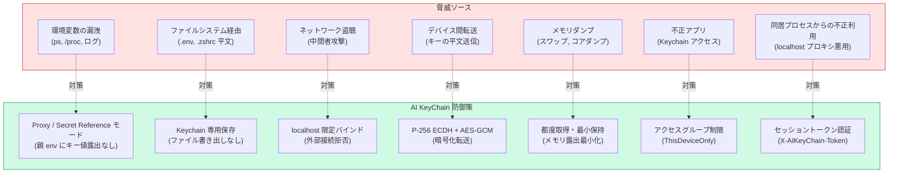
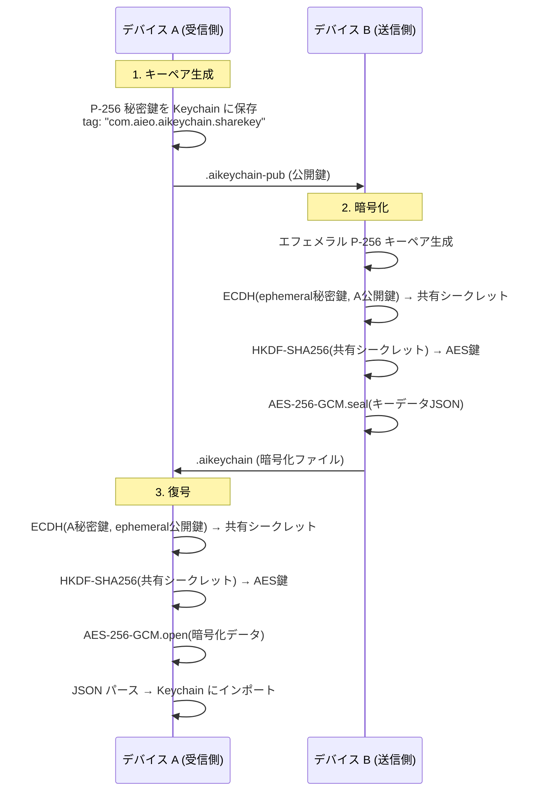

# セキュリティ設計

## 脅威モデル



## セキュリティレベル比較

| 方式 | 親 env キー値 | 子 env キー値 | ファイル露出 | ネットワーク | 利便性 |
|------|:----:|:----:|:----:|:----:|:-----:|
| .env ファイル | ✅ 露出 | ✅ 露出 | ✅ 露出 | - | ★★★ |
| .zshrc 平文 export | ✅ 露出 | ✅ 露出 | ✅ 露出 | - | ★★☆ |
| **Standard モード** | ✅ 露出 | ✅ 露出 | ❌ なし | - | ★★☆ |
| **Secret Reference モード** | ❌ 参照のみ | ✅ 露出 (`akc run` 子プロセス内) | ❌ なし | - | ★★★ |
| **Proxy モード** | ❌ なし (`*_BASE_URL` のみ) | ❌ なし | ❌ なし | localhost のみ | ★★★ |

## Keychain アクセス制御

### kSecAttrAccessible の選定

```
kSecAttrAccessibleAfterFirstUnlockThisDeviceOnly
```

| 属性 | 意味 |
|------|------|
| AfterFirstUnlock | ユーザーが 1 回ロック解除した後はアクセス可能 |
| ThisDeviceOnly | iCloud Keychain で同期しない (セキュリティ優先) |

::: tip なぜこの設定？
- `WhenUnlocked` だとスリープ復帰ごとにアクセス不可になり利便性が下がる
- `AfterFirstUnlock` は起動後 1 回のロック解除で以降アクセス可能
- `ThisDeviceOnly` でデバイス間の漏洩リスクを排除
:::

### Keychain クエリ構成

```swift
let query: [String: Any] = [
    kSecClass as String:          kSecClassGenericPassword,
    kSecAttrService as String:    "com.aieo.aikeychain",
    kSecAttrAccount as String:    envVarName,     // "ANTHROPIC_API_KEY"
    kSecValueData as String:      tokenData,       // UTF-8 encoded
    kSecAttrAccessible as String: kSecAttrAccessibleAfterFirstUnlockThisDeviceOnly
]
```

## Secret Reference モードのセキュリティ

`akc run` (`scripts/akc`) が `keychain://KEY_NAME` 形式の環境変数を実行時に解決する。

### 設計ポイント

| 項目 | 内容 |
|------|------|
| 親プロセス env | `keychain://KEY_NAME` の参照文字列のみ。キー値は含まれない |
| 解決タイミング | `akc run -- <command>` 実行時に `security find-generic-password` を呼び出す |
| 子プロセス env | `akc` が `exec` で起動する子プロセス環境にのみ実値を注入 |
| 親 env の変更 | しない（`akc` プロセスのみが実値を保持し終了で消える） |
| ドライラン | `akc run --dry-run` で対象キーをマスク表示（値は出力しない） |

::: tip Standard モードとの違い
Standard モードでは `.zshrc` の `export ANTHROPIC_API_KEY=$(security ...)` が **シェル全体に値を export** するため、`env` コマンドや `/proc` で値が見える。
Secret Reference モードでは親シェル env には参照文字列しか残らず、`akc run` で起動した子プロセスの中だけに値が存在する。
:::

## Proxy サーバーセキュリティ

### localhost 限定バインド

```swift
let params = NWParameters.tcp
params.acceptLocalOnly = true  // 外部ネットワークからの接続を拒否
params.requiredLocalEndpoint = NWEndpoint.hostPort(
    host: .ipv4(.loopback),
    port: NWEndpoint.Port(rawValue: port)!
)

let listener = try NWListener(using: params)
```

- `acceptLocalOnly = true` + `loopback` バインドにより、`127.0.0.1` からの接続のみ受付
- 外部ネットワークからのリクエストは OS レベルで拒否される
- ファイアウォール設定不要

### セッショントークン認証

localhost に同居する他プロセスからの不正利用を防止するため、プロキシは起動ごとに UUID トークンを生成する。

| 項目 | 内容 |
|------|------|
| 生成タイミング | `ProxyServer.start()` 時に `UUID().uuidString` |
| ヘッダ名 | `X-AIKeyChain-Token` |
| クライアント側 | `~/.aikeychain_proxy` に `AIKEYCHAIN_SESSION_TOKEN` として export |
| 検証 | 不一致 / 未提示の場合は HTTP 403 で拒否 |
| ライフサイクル | プロキシ停止時にメモリ・設定ファイルから消去 |

### リクエスト処理の安全性

| チェック | 内容 |
|---------|------|
| セッショントークン | `X-AIKeyChain-Token` 不一致は 403 |
| ホスト検証 | `ProxyRoute.route(for:)` に一致するホストのみ転送、未定義は 502 |
| Keychain 失敗 | 401 を返却 (キーなしで上流に送信しない) |
| HTTPS 強制 | 上流への転送は常に `https://` |

### プロキシ設定ファイルのライフサイクル

```
~/.aikeychain_proxy  ← プロキシ起動時に生成、停止時に削除
```

ファイル内容:

```bash
# AI KeyChain Proxy — this file is auto-managed
# Deleted when proxy stops. Do not edit manually.
export ANTHROPIC_BASE_URL=http://localhost:18121
export OPENAI_BASE_URL=http://localhost:18121
export XAI_BASE_URL=http://localhost:18121
export AIKEYCHAIN_SESSION_TOKEN=<UUID>
```

`.zshrc` のフックはプロキシのヘルスチェックを行い、応答がない場合は設定ファイルを自動削除:

```bash
if [ -f ~/.aikeychain_proxy ]; then
    _aikp=$(grep -om1 'localhost:[0-9]*' ~/.aikeychain_proxy | head -1 | cut -d: -f2)
    if [ -n "$_aikp" ] && /usr/bin/nc -z -G 1 127.0.0.1 "$_aikp" >/dev/null 2>&1; then
        source ~/.aikeychain_proxy
    else
        rm -f ~/.aikeychain_proxy  # プロキシ未稼働なら設定を削除
    fi
    unset _aikp
fi
```

::: warning 重要
プロキシ未稼働時に `BASE_URL` 環境変数が残ると、全ての AI API 呼び出しが失敗する。
ヘルスチェック + 自動削除でこの問題を防止している。
:::

### ProxyLog のセキュリティ要件

- **ディスクへの書き出しを行わない**（`ProxyLogStore` はメモリ上の `[ProxyLog]` のみ）
- **トークン値・リクエストボディを記録しない**（メソッド / パス / ステータス / レイテンシ のみ）
- アプリ終了でログは消える

## デバイス間キー転送の暗号化

### 暗号化方式

| 要素 | アルゴリズム |
|------|------------|
| 鍵交換 | P-256 ECDH (Elliptic Curve Diffie-Hellman) |
| 鍵導出 | HKDF-SHA256 (32 バイト) |
| データ暗号化 | AES-256-GCM (認証付き暗号) |

### 転送フロー



### ファイル形式

**公開鍵ファイル (.aikeychain-pub)**:
```json
{
    "version": 1,
    "publicKey": "<base64 x963 representation>"
}
```

**暗号化ファイル (.aikeychain)**:
```json
{
    "version": 1,
    "ephemeralPublicKey": "<base64 x963>",
    "encryptedData": "<base64 AES-256-GCM sealed box>",
    "keyCount": 5
}
```

### 秘密鍵の保管

| 項目 | 値 |
|------|-----|
| 保存先 | macOS Keychain |
| タグ | `"com.aieo.aikeychain.sharekey"` |
| 形式 | P-256 rawRepresentation (32 bytes) |
| アクセス | AfterFirstUnlockThisDeviceOnly |

## Entitlements

```xml
<dict>
    <key>keychain-access-groups</key>
    <array>
        <string>$(AppIdentifierPrefix)com.aieo.aikeychain</string>
    </array>
    <key>com.apple.security.network.client</key>
    <true/>
</dict>
```

| Entitlement | 用途 |
|-------------|------|
| `keychain-access-groups` | アプリ固有の Keychain グループ |
| `com.apple.security.network.client` | ProxyServer から上流 API への HTTPS 接続 |

## トークンバリデーション

入力されたトークンのプレフィックスをチェックし、誤入力を防止する。

| Service | Expected Prefix | Example |
|---------|----------------|---------|
| Anthropic | `sk-ant-` | `sk-ant-api03-xxxxx` |
| OpenAI | `sk-` | `sk-xxxxx` |
| GitHub | `ghp_` or `gho_` | `ghp_xxxxx` |
| GitLab | `glpat-` | `glpat-xxxxx` |
| xAI | `xai-` | `xai-xxxxx` |
| Tailscale | `tskey-` | `tskey-client-xxxxx` |
| Slack | `xapp-` or `xoxb-` | `xapp-1-xxxxx` |

::: warning 注意
プレフィックスチェックは **警告のみ** で、保存をブロックはしない。
サービス側がプレフィックス形式を変更する可能性があるため。
:::

## クリップボード自動クリア

トークン値をクリップボードにコピーした場合、**30 秒後に自動クリア** する。

```swift
func copyToClipboard(_ value: String) {
    NSPasteboard.general.clearContents()
    NSPasteboard.general.setString(value, forType: .string)

    DispatchQueue.main.asyncAfter(deadline: .now() + 30) {
        NSPasteboard.general.clearContents()
    }
}
```

## セキュリティチェックリスト

- [x] Keychain にのみシークレットを保存 (ファイル書き出しなし)
- [x] SecureField で入力中のマスキング
- [x] メモリ上でのトークン保持を最小化 (都度取得)
- [x] クリップボード 30 秒自動クリア
- [x] Keychain アクセスグループ制限
- [x] ThisDeviceOnly で iCloud 同期無効
- [x] Proxy: localhost 限定バインド (acceptLocalOnly + loopback)
- [x] Proxy: セッショントークン認証 (X-AIKeyChain-Token)
- [x] Proxy: HTTPS 強制 (上流転送)
- [x] Proxy: ヘルスチェック付き設定ファイルライフサイクル
- [x] Proxy: ログをメモリ上のみで保持 (ディスクなし、ボディ未記録)
- [x] Secret Reference: 親 env にキー値を露出させず子プロセスのみに注入
- [x] 転送: P-256 ECDH + AES-256-GCM 暗号化
- [x] 転送: エフェメラルキーによる前方秘匿性
- [x] Export 時の平文警告表示
