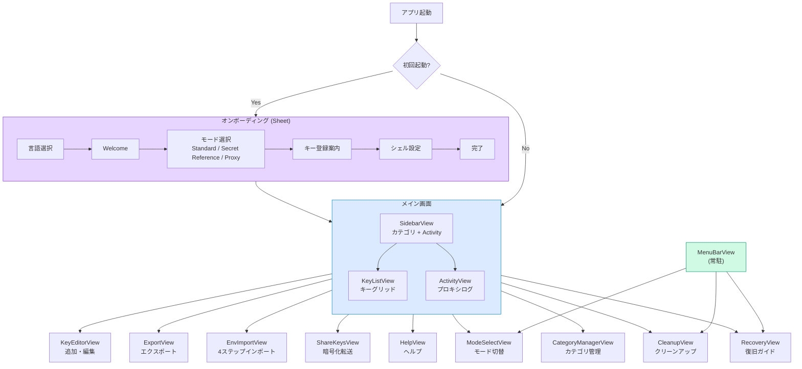

# UI/UX デザイン

## 画面一覧

### メインウィンドウ

| 画面 | ファイル | 種別 | 説明 |
|------|---------|------|------|
| MainView | Main/MainView.swift | Root | NavigationSplitView (Sidebar + Detail) |
| SidebarView | Main/SidebarView.swift | Sidebar | カテゴリ + Activity ナビゲーション + キー数バッジ |
| KeyListView | Main/KeyListView.swift | Detail | キーグリッド + 検索 + インポート |
| KeyRowView | Main/KeyRowView.swift | Cell | サービスアイコン + 名前 + ステータス |
| ActivityView | ActivityView.swift | Detail | プロキシリクエストログのリアルタイム表示 |

### エディタ・シート

| 画面 | ファイル | 種別 | 説明 |
|------|---------|------|------|
| KeyEditorView | Editor/KeyEditorView.swift | Sheet | キー追加・編集フォーム |
| ExportView | Export/ExportView.swift | Sheet | .zshrc / Secret Reference / .env エクスポート |
| ShareKeysView | ShareKeysView.swift | Sheet | P-256 暗号化キー転送 (3 タブ) |
| EnvImportView | EnvImportView.swift | Sheet | 4 ステップ env インポートウィザード |
| CategoryManagerView | CategoryManagerView.swift | Sheet | カスタムカテゴリ CRUD |

### モード・設定

| 画面 | ファイル | 種別 | 説明 |
|------|---------|------|------|
| ModeSelectView | ModeSelectView.swift | Sheet | Standard / Secret Reference / Proxy のカード選択 |
| CleanupView | CleanupView.swift | Sheet | .zshrc クリーンアップガイド |
| RecoveryView | RecoveryView.swift | Sheet | プロキシ復旧ガイド (3 手段) |
| HelpView | HelpView.swift | Sheet | ユーザーマニュアル |

### オンボーディング

| 画面 | ファイル | 種別 | 説明 |
|------|---------|------|------|
| OnboardingView | Onboarding/OnboardingView.swift | Sheet | 6 ステップウィザードコンテナ (言語選択を含む) |

### メニューバー

| 画面 | ファイル | 種別 | 説明 |
|------|---------|------|------|
| MenuBarView | MenuBarView.swift | MenuBarExtra | プロキシ状態・モード切替・ポート変更・累計リクエスト数 |

## 画面フロー



## メイン画面構成

```
┌─────────────────────────────────────────────────────────┐
│ ツールバー: [Mode ● Status] [Transfer] [Help ▾]         │
├──────────────┬──────────────────────────────────────────┤
│ Sidebar      │ KeyList / ActivityView                    │
│              │                                           │
│ All Keys     │ AI API                    3 keys          │
│ Activity     │ ┌─────────────────────────────────────┐  │
│              │ │ 🧠 Anthropic (Claude)    ✅        │  │
│ AI API    (4)│ │    ANTHROPIC_API_KEY                │  │
│ AI Web    (5)│ ├─────────────────────────────────────┤  │
│ Code&Git  (2)│ │ 🤖 OpenAI               ⚠️        │  │
│ Cloud     (3)│ │    OPENAI_API_KEY                   │  │
│ Comm      (2)│ ├─────────────────────────────────────┤  │
│ DevTools  (1)│ │ ...                                  │  │
│              │ └─────────────────────────────────────┘  │
│ ─────────── │                                           │
│ Custom Cat   │                                           │
│              │                                           │
│ [Manage]     │                                           │
│ ✅ 12  ⚠️ 5 │ [Import .env]              [+ Add Key]   │
└──────────────┴──────────────────────────────────────────┘
```

## キー編集シート

| 要素 | 内容 |
|------|------|
| サービス選択 | Picker (追加時のみ変更可) |
| カテゴリ選択 | ビルトイン + カスタムカテゴリ |
| 環境変数名 | サービス選択で自動入力 (編集可) |
| トークン入力 | SecureField + 目のアイコンで表示/非表示 |
| プレフィックス警告 | トークンが期待プレフィックスと不一致の場合に表示 |
| セットアップリンク | "Get Token" ボタンで発行ページを開く |
| 削除ボタン | 編集時のみ表示 (赤色) |
| 保存ボタン | "Keychain に保存" |

## Activity 画面

プロキシモード時にリクエストの状況を可視化する。

| 要素 | 内容 |
|------|------|
| サマリヘッダ | `Today: N requests` / `Errors: N` (赤 / 緑で状態色分け) |
| ログ一覧 | 時刻 / サービス名 / メソッド / パス / ステータスコード / レイテンシ |
| エラー強調 | `isError = true` のログは行全体を赤系で表示 |
| Clear ボタン | メモリ内ログを全消去 |

::: warning ログの取扱い
- ディスクには一切書き出されない（メモリ上のみ）
- トークン値・リクエストボディは記録しない
- アプリ再起動でログは消える
:::

## メニューバー UI

```
┌──────────────────────────┐
│ 🔑 AI KeyChain           │
├──────────────────────────┤
│ Mode: 🛡️ Proxy           │
│ Status: 🟢 Running       │
│ Port: 18121               │
│ Requests: 42              │
├──────────────────────────┤
│ Change Mode...            │
│ Stop Proxy                │
│ Change Port...            │
│ Recovery Guide            │
├──────────────────────────┤
│ Open KeyChain             │
│ Open Keychain Access      │
│ ☑ Launch at Login         │
│ Shell Cleanup             │
│ Show Tutorial             │
├──────────────────────────┤
│ Quit                      │
└──────────────────────────┘
```

## モード選択カード

| モード | アイコン | 特徴 |
|--------|---------|------|
| **Standard** | 🔑 key.fill | Keychain 直接参照、シンプル、常駐不要 |
| **Secret Reference** | 🔗 link | `keychain://` 参照を `akc run` が解決、親 env にキー値を露出させない |
| **Proxy** | 🛡️ shield.lefthalf.filled | 環境変数にキー値を一切露出させない、アプリ常駐必要 |

Proxy モード選択時は **同意シート** を表示:
- プロキシの常時起動が必要な旨の警告
- 復旧方法の案内
- チェックボックスで同意後に有効化

## ShareKeysView (3 タブ)

| タブ | 内容 |
|------|------|
| **My Keys** | P-256 キーペア生成・公開鍵エクスポート |
| **Send** | キー選択 → 相手の公開鍵で暗号化 → .aikeychain ファイル生成 |
| **Receive** | .aikeychain ファイル読込 → 秘密鍵で復号 → Keychain インポート |

## EnvImportView (4 ステップ)

| Step | 内容 |
|------|------|
| 1 | env コマンドのコピーガイド |
| 2 | 出力ペースト → 認識キーの自動スキャン |
| 3 | インポート対象のプレビュー |
| 4 | Keychain インポート結果表示 |

## ExportView (3 形式)

| 形式 | 用途 |
|------|------|
| `.zshrc (Keychain reference)` | Standard モード用。`security find-generic-password ...` の export 行を生成 |
| `.zshrc (Secret Reference)` | Secret Reference モード用。`export KEY="keychain://KEY"` を生成 |
| `.env (plaintext)` | 値は `<VALUE>` プレースホルダで出力（平文書き出し回避） |

## ローカライズ (ja / en)

- 表示言語は `AppState.appLanguage` (`ja` / `en`) で切替
- 文字列は `L10n.t("key")` 経由で取得
- 言語選択はオンボーディング初回ステップ、または設定画面から変更可
- `MainView` などは `.id(appState.appLanguage)` で言語切替時に再描画

## カラーパレット

### カテゴリカラー

| カテゴリ | カラー | Hex |
|---------|--------|-----|
| AI API | Purple | `#7C3AED` |
| AI Web | Pink | `#DB2777` |
| Code & Git | Orange | `#EA580C` |
| Cloud & Infra | Blue | `#0284C7` |
| Communication | Green | `#059669` |
| Developer Tools | Gray | `#6B7280` |

### ステータスカラー

| ステータス | カラー | Hex |
|-----------|--------|-----|
| 設定済み | Emerald | `#10B981` |
| 未設定 | Amber | `#F59E0B` |
| エラー | Red | `#DC2626` |

### アクセントグラデーション

```
#7C3AED (Purple) → #0284C7 (Blue) → #059669 (Green)
```

## タイポグラフィ

| 用途 | フォント | サイズ |
|------|---------|--------|
| ページタイトル | System Bold | 28pt |
| セクションタイトル | System Semibold | 20pt |
| 本文 | System Regular | 14pt |
| コード・トークン | SF Mono | 13pt |
| バッジ | System Medium | 11pt |
| キャプション | System Regular | 12pt |

## アニメーション仕様

| 対象 | 種類 | 時間 |
|------|------|------|
| オンボーディング遷移 | slide + fade | 0.3s (spring) |
| モード選択カード | scale (spring) | 0.3s |
| ステータスバッジ変化 | scale + color | 0.2s (easeInOut) |
| シート表示 | system default | - |
| 保存成功フィードバック | checkmark scale | 0.5s (spring bounce) |

## ダークモード

- システムデフォルトの背景色を使用
- カテゴリカラー・ステータスカラーは明度自動調整
- アイコンは SF Symbols のため自動対応
